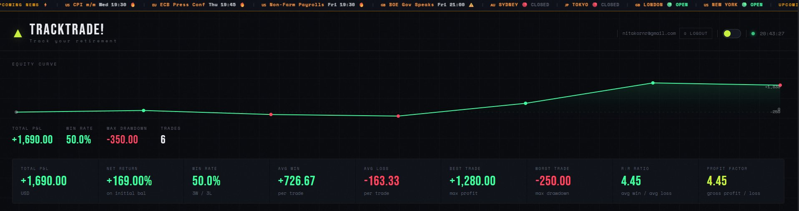
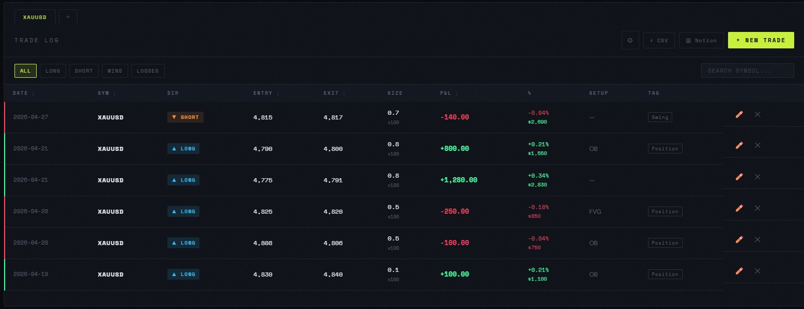
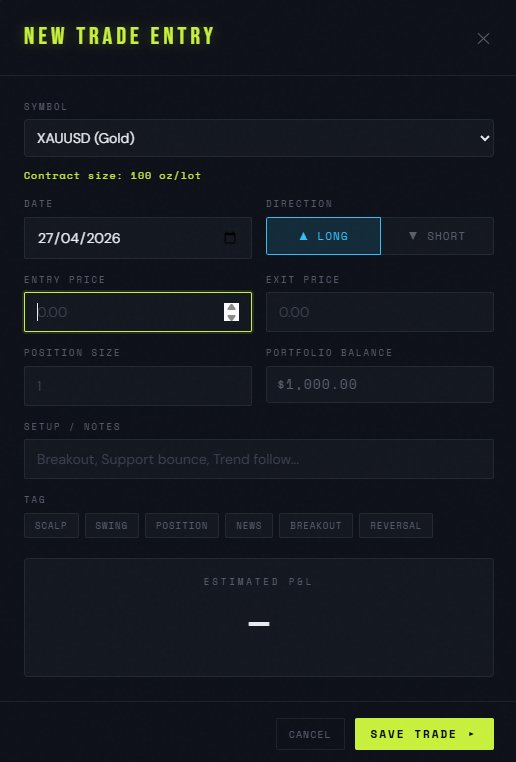

# 📈 TradeLog — Personal Trading Journal

A cinematic, dark-themed trading journal web app built with vanilla JavaScript and Supabase.  
Track trades, analyze performance, and visualize your equity curve — all in one place.

<!-- Replace with your actual screenshot -->
<!--  -->

---

## Features

### 📊 Dashboard
- **Live equity curve** — canvas-drawn P&L chart with win/loss dot markers
- **9 performance metrics** — Win rate, R:R ratio, Profit Factor, Max Drawdown, and more
- **Heatmap calendar** — daily P&L intensity view, navigatable by month
- **Win/Loss breakdown** — visual bar with gross profit vs gross loss
- **Symbol performance** — top 6 symbols ranked by absolute P&L
- **Streak tracker** — current and best win/loss streak with dot history

### 📝 Trade Log
- Add, edit, delete trades with a modal form
- Live **P&L preview** while filling in entry/exit (auto-pulls portfolio balance)
- Auto-calculated **% return** and **running balance** per trade row
- Filter by direction (Long/Short) or result (Win/Loss)
- Search by symbol, tag, or setup notes
- Sort by any column
- Pagination (50 rows/page)

### 💼 Portfolio Management
- Create multiple portfolios with custom names and starting balance
- Switch between portfolios with tab navigation
- Edit or delete portfolios anytime

### 📡 Forex Ticker
- Live market session status (Sydney, Tokyo, London, New York)
- Upcoming high-impact news events
- Customizable scroll speed and highlight color

### 📤 Export
- **CSV export** — import into Excel or Google Sheets
- **Notion export** — tab-separated copy-paste ready

### 🎨 UI / UX
- Dark / Light theme toggle (persisted)
- Keyboard shortcuts: `Ctrl+N` new trade, `Esc` close modal
- Toast notifications
- Responsive layout

---

## 🛠 Tech Stack

| Layer | Technology |
|-------|-----------|
| Frontend | Vanilla HTML, CSS, JavaScript (ES6+) |
| Database | [Supabase](https://supabase.com) (PostgreSQL + Auth) |
| Auth | Supabase Auth (email/password) |
| Charts | Canvas API (custom drawn) |
| Hosting | GitHub Pages |
| Fonts | Space Mono, DM Sans (Google Fonts) |

> No frameworks, no bundler — pure vanilla JS split into modular files.

---

## 🗂 Project Structure

```
tradelog/
├── index.html          # Main app shell + modal markup
├── style.css           # All styles (CSS variables, dark/light theme)
├── js/
│   ├── config.js       # Supabase init, global state, helper functions
│   ├── db.js           # CRUD operations (portfolios + trades)
│   ├── auth.js         # Login, register, logout, email cooldown
│   ├── portfolio.js    # Portfolio tabs, settings, welcome flow
│   ├── ticker.js       # Forex ticker tape, market sessions, news
│   ├── modal.js        # Trade modal, form logic, export (CSV/Notion)
│   └── ui.js           # All render functions: equity, metrics, table, heatmap
└── README.md
```

## 📸 Screenshots

> _Add your screenshots here_

| Dashboard | Trade Log | Add Trade |
|-----------|-----------|-----------|
|  |  |  |

---

## 🗺 Roadmap

- [ ] Import trades from broker CSV
- [ ] Calendar day view (click date → see trades)
- [ ] Per-symbol equity curve breakdown
- [ ] Custom tag management
- [ ] Live forex prices via WebSocket

---

## 👤 Author

**Rapeepat Nitakorn (Fifa)**  
Student @ KMITL · [GitHub](https://github.com/77Henvi)

